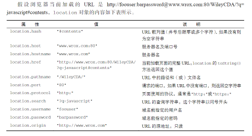

## <mark class="hltr-gray ">" THE LOCATION OBJECT "</mark> [Page 14 ](zotero://open-pdf/library/items/Q5ZZIU26?page=14&annotation=KSV5WE77)

- <mark class="hltr-gray ">" Query String Arguments "</mark> [Page 15 ](zotero://open-pdf/library/items/Q5ZZIU26?page=15&annotation=VECIZM4P)
  - <mark class="hltr-gray ">" URLSearchParams "</mark> [Page 16 ](zotero://open-pdf/library/items/Q5ZZIU26?page=16&annotation=V4T3AFHD)
  - location.search [📌](<obsidian://jump-to-pdf?pdf=Source%2FS-JS%2FB-JS%2FProJS%2FJavaScript%E9%AB%98%E7%BA%A7%E7%A8%8B%E5%BA%8F%E8%AE%BE%E8%AE%A1(%E7%AC%AC4%E7%89%88%20%E4%B8%AD%E6%96%87%E9%AB%98%E6%B8%85).pdf&annotate=72d9c12c-5d04-c95a>)
    - 返回了从问号开始直到 URL 末尾的所有内容，但没有办法逐个访问每个查询参数 [📌](<obsidian://jump-to-pdf?pdf=Source%2FS-JS%2FB-JS%2FProJS%2FJavaScript%E9%AB%98%E7%BA%A7%E7%A8%8B%E5%BA%8F%E8%AE%BE%E8%AE%A1(%E7%AC%AC4%E7%89%88%20%E4%B8%AD%E6%96%87%E9%AB%98%E6%B8%85).pdf&annotate=a25e9d2b-ce17-f8b6>)
  - URLSearchParams [📌](<obsidian://jump-to-pdf?pdf=Source%2FS-JS%2FB-JS%2FProJS%2FJavaScript%E9%AB%98%E7%BA%A7%E7%A8%8B%E5%BA%8F%E8%AE%BE%E8%AE%A1(%E7%AC%AC4%E7%89%88%20%E4%B8%AD%E6%96%87%E9%AB%98%E6%B8%85).pdf&annotate=86862414-863d-95f1>)
    - 提供了一组标准 API 方法，通过它们可以检查和修改查询字符串 [📌](<obsidian://jump-to-pdf?pdf=Source%2FS-JS%2FB-JS%2FProJS%2FJavaScript%E9%AB%98%E7%BA%A7%E7%A8%8B%E5%BA%8F%E8%AE%BE%E8%AE%A1(%E7%AC%AC4%E7%89%88%20%E4%B8%AD%E6%96%87%E9%AB%98%E6%B8%85).pdf&annotate=c4388b1c-811a-20cc>)
    - 给 URLSearchParams 构造函数传入一个查询字符串，就可以创建一个实例 [📌](<obsidian://jump-to-pdf?pdf=Source%2FS-JS%2FB-JS%2FProJS%2FJavaScript%E9%AB%98%E7%BA%A7%E7%A8%8B%E5%BA%8F%E8%AE%BE%E8%AE%A1(%E7%AC%AC4%E7%89%88%20%E4%B8%AD%E6%96%87%E9%AB%98%E6%B8%85).pdf&annotate=8763001c-950d-1ccf>)
    - 这个实例上暴露了 get()、 set()和 delete()等方法，可以对查询字符串执行相应操作 [📌](<obsidian://jump-to-pdf?pdf=Source%2FS-JS%2FB-JS%2FProJS%2FJavaScript%E9%AB%98%E7%BA%A7%E7%A8%8B%E5%BA%8F%E8%AE%BE%E8%AE%A1(%E7%AC%AC4%E7%89%88%20%E4%B8%AD%E6%96%87%E9%AB%98%E6%B8%85).pdf&annotate=033d58ea-3f76-8fc2>)
    - 大多数支持 URLSearchParams 的浏览器也支持将 URLSearchParams 的实例用作可迭代对象 [📌](<obsidian://jump-to-pdf?pdf=Source%2FS-JS%2FB-JS%2FProJS%2FJavaScript%E9%AB%98%E7%BA%A7%E7%A8%8B%E5%BA%8F%E8%AE%BE%E8%AE%A1(%E7%AC%AC4%E7%89%88%20%E4%B8%AD%E6%96%87%E9%AB%98%E6%B8%85).pdf&annotate=e0fef874-0219-f7d2>)
- <mark class="hltr-gray ">" Manipulating the Location "</mark> [Page 16 ](zotero://open-pdf/library/items/Q5ZZIU26?page=16&annotation=A6WQA88H)
  - assign()方法 [📌](<obsidian://jump-to-pdf?pdf=Source%2FS-JS%2FB-JS%2FProJS%2FJavaScript%E9%AB%98%E7%BA%A7%E7%A8%8B%E5%BA%8F%E8%AE%BE%E8%AE%A1(%E7%AC%AC4%E7%89%88%20%E4%B8%AD%E6%96%87%E9%AB%98%E6%B8%85).pdf&annotate=d7a4310d-2afe-34dd>)
  - 传入一 个 URL [📌](<obsidian://jump-to-pdf?pdf=Source%2FS-JS%2FB-JS%2FProJS%2FJavaScript%E9%AB%98%E7%BA%A7%E7%A8%8B%E5%BA%8F%E8%AE%BE%E8%AE%A1(%E7%AC%AC4%E7%89%88%20%E4%B8%AD%E6%96%87%E9%AB%98%E6%B8%85).pdf&annotate=7750acb1-81d9-a7d1>)
  - 可以通过修改 location 对象修改浏览器的地址 [📌](<obsidian://jump-to-pdf?pdf=Source%2FS-JS%2FB-JS%2FProJS%2FJavaScript%E9%AB%98%E7%BA%A7%E7%A8%8B%E5%BA%8F%E8%AE%BE%E8%AE%A1(%E7%AC%AC4%E7%89%88%20%E4%B8%AD%E6%96%87%E9%AB%98%E6%B8%85).pdf&annotate=1fc47d12-ebbb-a512>)
  - location.assign("http://www.wrox.com"); [📌](<obsidian://jump-to-pdf?pdf=Source%2FS-JS%2FB-JS%2FProJS%2FJavaScript%E9%AB%98%E7%BA%A7%E7%A8%8B%E5%BA%8F%E8%AE%BE%E8%AE%A1(%E7%AC%AC4%E7%89%88%20%E4%B8%AD%E6%96%87%E9%AB%98%E6%B8%85).pdf&annotate=f2964aee-b408-3eca>)
  - 这行代码会立即启动导航到新 URL 的操作，同时在浏览器历史记录中增加一条记录 [📌](<obsidian://jump-to-pdf?pdf=Source%2FS-JS%2FB-JS%2FProJS%2FJavaScript%E9%AB%98%E7%BA%A7%E7%A8%8B%E5%BA%8F%E8%AE%BE%E8%AE%A1(%E7%AC%AC4%E7%89%88%20%E4%B8%AD%E6%96%87%E9%AB%98%E6%B8%85).pdf&annotate=f1dcc839-1419-bebd>)
  - 如果给 location.href 或 window.location 设置一个 URL，也会以同一个 URL 值调用 assign()方法。 [📌](<obsidian://jump-to-pdf?pdf=Source%2FS-JS%2FB-JS%2FProJS%2FJavaScript%E9%AB%98%E7%BA%A7%E7%A8%8B%E5%BA%8F%E8%AE%BE%E8%AE%A1(%E7%AC%AC4%E7%89%88%20%E4%B8%AD%E6%96%87%E9%AB%98%E6%B8%85).pdf&annotate=667f5962-4107-98ac>)
  - 3 种修改浏览器地址的方法中，设置 location.href 是最常见的。 [📌](<obsidian://jump-to-pdf?pdf=Source%2FS-JS%2FB-JS%2FProJS%2FJavaScript%E9%AB%98%E7%BA%A7%E7%A8%8B%E5%BA%8F%E8%AE%BE%E8%AE%A1(%E7%AC%AC4%E7%89%88%20%E4%B8%AD%E6%96%87%E9%AB%98%E6%B8%85).pdf&annotate=85f36b7e-233e-c491>)
  - window.location = "http://www.wrox.com"; [📌](<obsidian://jump-to-pdf?pdf=Source%2FS-JS%2FB-JS%2FProJS%2FJavaScript%E9%AB%98%E7%BA%A7%E7%A8%8B%E5%BA%8F%E8%AE%BE%E8%AE%A1(%E7%AC%AC4%E7%89%88%20%E4%B8%AD%E6%96%87%E9%AB%98%E6%B8%85).pdf&annotate=2d2db39e-d3e8-fdfc>)
  - location.href = "http://www.wrox.com"; [📌](<obsidian://jump-to-pdf?pdf=Source%2FS-JS%2FB-JS%2FProJS%2FJavaScript%E9%AB%98%E7%BA%A7%E7%A8%8B%E5%BA%8F%E8%AE%BE%E8%AE%A1(%E7%AC%AC4%E7%89%88%20%E4%B8%AD%E6%96%87%E9%AB%98%E6%B8%85).pdf&annotate=fe4fdd45-cb30-7824>)
  - 修改 location 对象的属性也会修改当前加载的页面。其中，hash、search、hostname、pathname 和 port 属性被设置为新值之后都会修改当前 URL [📌](<obsidian://jump-to-pdf?pdf=Source%2FS-JS%2FB-JS%2FProJS%2FJavaScript%E9%AB%98%E7%BA%A7%E7%A8%8B%E5%BA%8F%E8%AE%BE%E8%AE%A1(%E7%AC%AC4%E7%89%88%20%E4%B8%AD%E6%96%87%E9%AB%98%E6%B8%85).pdf&annotate=d9fdd243-4f62-5ada>)
  - reload() [📌](<obsidian://jump-to-pdf?pdf=Source%2FS-JS%2FB-JS%2FProJS%2FJavaScript%E9%AB%98%E7%BA%A7%E7%A8%8B%E5%BA%8F%E8%AE%BE%E8%AE%A1(%E7%AC%AC4%E7%89%88%20%E4%B8%AD%E6%96%87%E9%AB%98%E6%B8%85).pdf&annotate=d4ae9312-b6a1-3b02>)
  - 能重新加载当前显示的页面 [📌](<obsidian://jump-to-pdf?pdf=Source%2FS-JS%2FB-JS%2FProJS%2FJavaScript%E9%AB%98%E7%BA%A7%E7%A8%8B%E5%BA%8F%E8%AE%BE%E8%AE%A1(%E7%AC%AC4%E7%89%88%20%E4%B8%AD%E6%96%87%E9%AB%98%E6%B8%85).pdf&annotate=482d04a0-f960-bd90>)
  - replace()方法 [📌](<obsidian://jump-to-pdf?pdf=Source%2FS-JS%2FB-JS%2FProJS%2FJavaScript%E9%AB%98%E7%BA%A7%E7%A8%8B%E5%BA%8F%E8%AE%BE%E8%AE%A1(%E7%AC%AC4%E7%89%88%20%E4%B8%AD%E6%96%87%E9%AB%98%E6%B8%85).pdf&annotate=5660e3ff-77f0-47a1>)
  - 这个方法接 收一个 URL 参数，但重新加载后不会增加历史记录 [📌](<obsidian://jump-to-pdf?pdf=Source%2FS-JS%2FB-JS%2FProJS%2FJavaScript%E9%AB%98%E7%BA%A7%E7%A8%8B%E5%BA%8F%E8%AE%BE%E8%AE%A1(%E7%AC%AC4%E7%89%88%20%E4%B8%AD%E6%96%87%E9%AB%98%E6%B8%85).pdf&annotate=6312e1ca-cf82-849b>)
  - 调用 replace()之后，用户不能回到前一页 [📌](<obsidian://jump-to-pdf?pdf=Source%2FS-JS%2FB-JS%2FProJS%2FJavaScript%E9%AB%98%E7%BA%A7%E7%A8%8B%E5%BA%8F%E8%AE%BE%E8%AE%A1(%E7%AC%AC4%E7%89%88%20%E4%B8%AD%E6%96%87%E9%AB%98%E6%B8%85).pdf&annotate=fec35c21-bea5-fcc4>)
- 提供了当前窗口中加载文档的信息，以及通常的导航功能。 [📌](<obsidian://jump-to-pdf?pdf=Source%2FS-JS%2FB-JS%2FProJS%2FJavaScript%E9%AB%98%E7%BA%A7%E7%A8%8B%E5%BA%8F%E8%AE%BE%E8%AE%A1(%E7%AC%AC4%E7%89%88%20%E4%B8%AD%E6%96%87%E9%AB%98%E6%B8%85).pdf&annotate=58e1dc43-eb27-6864>)
- 它既是 window 的属性，也是 document 的属性 [📌](<obsidian://jump-to-pdf?pdf=Source%2FS-JS%2FB-JS%2FProJS%2FJavaScript%E9%AB%98%E7%BA%A7%E7%A8%8B%E5%BA%8F%E8%AE%BE%E8%AE%A1(%E7%AC%AC4%E7%89%88%20%E4%B8%AD%E6%96%87%E9%AB%98%E6%B8%85).pdf&annotate=900c64e6-8e91-8bf8>)
- window.location 和 document.location 指向同一个对象 [📌](<obsidian://jump-to-pdf?pdf=Source%2FS-JS%2FB-JS%2FProJS%2FJavaScript%E9%AB%98%E7%BA%A7%E7%A8%8B%E5%BA%8F%E8%AE%BE%E8%AE%A1(%E7%AC%AC4%E7%89%88%20%E4%B8%AD%E6%96%87%E9%AB%98%E6%B8%85).pdf&annotate=6acb3b33-fbf4-152e>)
- 不仅保存着当前加载文 档的信息 [📌](<obsidian://jump-to-pdf?pdf=Source%2FS-JS%2FB-JS%2FProJS%2FJavaScript%E9%AB%98%E7%BA%A7%E7%A8%8B%E5%BA%8F%E8%AE%BE%E8%AE%A1(%E7%AC%AC4%E7%89%88%20%E4%B8%AD%E6%96%87%E9%AB%98%E6%B8%85).pdf&annotate=1faa2ee2-831e-aa0b>)
- 也保存着把 URL 解析为离散片段后能够通过属性访问的信息 [📌](<obsidian://jump-to-pdf?pdf=Source%2FS-JS%2FB-JS%2FProJS%2FJavaScript%E9%AB%98%E7%BA%A7%E7%A8%8B%E5%BA%8F%E8%AE%BE%E8%AE%A1(%E7%AC%AC4%E7%89%88%20%E4%B8%AD%E6%96%87%E9%AB%98%E6%B8%85).pdf&annotate=e1e8334f-85d1-bcf4>)
-  [📌](<obsidian://jump-to-pdf?pdf=Source%2FS-JS%2FB-JS%2FProJS%2FJavaScript%E9%AB%98%E7%BA%A7%E7%A8%8B%E5%BA%8F%E8%AE%BE%E8%AE%A1(%E7%AC%AC4%E7%89%88%20%E4%B8%AD%E6%96%87%E9%AB%98%E6%B8%85).pdf&annotate=f8872357-3c35-b2dd>)
