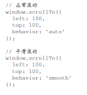
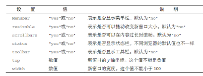

# Window Object

## 定义
- all variables and functions declared in the global scope become properties on window.  
- 浏览器将 window 对象实现为 Global 对象的代理
- window 对象在 JavaScript 中远不止实现了 ECMAScript 的 Global 对象那么简单。
- BOM 的核心是 window 对象 
- 一个是 ECMAScript 中的 Global 对象 
- 浏览器窗口的 JavaScript 接口 
- 网页中定义的所有 对象、变量和函数都以 window 作为其 Global 对象，都可以访问其上定义的 parseInt()等全局方法 
- 很多浏览器 API 及相关构造函数 都以 window 对象属性的形式暴露出来 
- The Global Scope

## Window Relationships

- top 对象
  - 始终指向最上层（最外层）窗口，即浏览器窗口本身
- parent 对象
- self 对象
  - 是终极 window 属性，始终会指向 window
  - self 和 window 就 是同一个对象
- 可以把访问多个窗口的 window 对象串联起来，比如 window.parent.parent

## Window Position and Pixel Ratio 

- screenLeft
- screenTop 属性
  - 用于表示窗口相对于屏幕左侧和顶部的位置 ，返回值的单位是 CSS 像素
- moveTo()和 moveBy()方法
  - 移动窗口
  - moveTo()接 收要移动到的新位置的绝对坐标 x 和 y
  - moveBy()则接收相对当前位置在两个方向上移动的像素数
- 像素比
  - window.devicePixelRatio 属性

## Window Size

- outerWidth 和 outerHeight
  - 返回浏 览器窗口自身的大小（不管是在最外层 window 上使用，还是在窗格<frame>中使用）
- innerWidth 和 innerHeight
  - 确定页面视口的大小,（不包含浏览器边框和工具栏）
- document.documentElement.clientWidth 和 document.documentElement.clientHeight
  - 返回页面视口的宽度和高度
- resizeTo() 
  - 接收新的宽度和高度值
- resizeBy()
  - 接收宽度和高度各要缩放多少

## Window Viewport Position

- 度量文档相对于视口滚动距离的属性有两对
  - window.pageXoffset/window. scrollX
  - window.pageYoffset/window.scrollY
- 滚动页面
  - scroll()、scrollTo()和 scrollBy()方法
    - 都接收表示相对视口距 离的 x 和 y 坐标
    - 在前两个方法中表示要滚动到的坐标
    - 在最后一个方法中表示滚动的距离
- ScrollToOptions 字典
  - 提供偏移值，还可以通过 behavior 属性 告诉浏览器是否平滑滚动
  - 

## Navigating and Opening Windows 

- Popping Up Windows 
  - window.open()方法
    - 接收 4 个参数
      - 要加载的 URL 
      - 目标窗口 
      - 特性字符串
        - 特性字符串是一个逗号分隔的设置字符串，用于指定新窗口包含的特性
        - 如果没有传第三个参数，则新窗口（或标签页）会带有所有默 认的浏览器特性（工具栏、地址栏、状态栏等都是默认配置）
        - 如果打开的不是新窗口，则忽略第三个 参数
        -  
        -  
        - 这些设置需要以逗号分隔的名值对形式出现
        - 名值对以等号连接 
        - 不能包含空 格
      - 表示新窗口在浏览器历史记录中是否替代当前加载页 面的布尔值
        - 最后一个参数只有在不打开新窗口时才会使用
  - close()方法
- Security Restrictions 
  - 浏览器会在用户操作下才允许创建弹窗。在网页加载过程中调用 window.open()没有效果， 而且还可能导致向用户显示错误。弹窗通常可能在鼠标点击或按下键盘中某个键的情况下才能打开
- Pop-up Blockers 

## Intervals and Timeouts 

- [Timer-计时器函数](Timer-计时器函数.md)
- setTimeout() 
  - 用于指定在一定时间后执行某些代码
  - setTimeout()方法通常接收两个参数
    - 要执行的代码
    - 执行回调函数前等待的时间（毫秒）
- setInterval()
  - 用于指定 每隔一段时间执行某些代码

## System Dialogs 

- 这些对话框都是同步的模态对话框
  - alert()
  - confirm()
    - 确认框 
    - 确认框有两个按钮：“Cancel”（取消）和“OK”（确定）。
  - prompt()方法
    - 提示用户输入消息。 除了 OK 和 Cancel 按钮，提示框还会显示一个文本框，让用户输入内容
  - 它们显示的时候，代码会停止执行， 在它们消失以后，代码才会恢复执行。
  - 外观由操作系统或者浏览器决定， 无法使用 CSS 设置
- 这两种对话框都是异步显示的，即控 制权会立即返回给脚本
  - find()
  - print()
  - 这两个方法不会返回任何有关用户在对话框中执行了什么操作的信息，因此很难加以利用 
