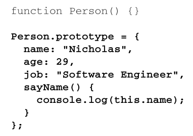
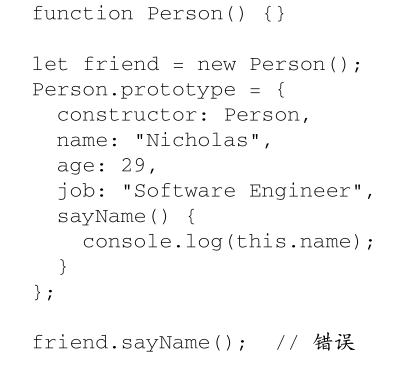

---

Basic

### 理解原型 (`prototype`, `__proto__`, `prototype.constructor`)

Back:

#### `prototype` 属性

- 构造函数通过 prototype 属性链接到原型对象
  - `Person.prototype.sayName = function() {   console.log(this.name);  };`
  - 每个函数都会创建一个
  - 是通过调用构造函数创建的对象的原型
- 包含应被实例共享的属性和方法
  - `prototype.constructor` 属性
    - 所有原型对象自动获得
    - 指回与之关联的构造函数
    - `构造函数.prototype.constructor === 该构造函数本身`
  - `prototype.isPrototypeOf()`
    - `console.log(Person.prototype.isPrototypeOf(person1));  // true`

#### `__proto__` 属性

- 实例通过 `__proto__` 链接到构造函数原型对象
  - 实例的内部 `[[Prototype]]` 指针就会被赋值为构造函数的原型对象
- 通过这个属性可以访问对象的原型
  - Object 原型的原型是 null: `Object.prototype.__proto__ === null`
  - 正常的原型链都会终止于 Object 的原型对象 `Object.prototype`

#### 特殊原型对象

- [SpecialPrototype.js](file:///e%3A/SynologyDrive/TechSkills/JS/B-JS/ProJS-Code/Chapter8ObjectsClassesAndObjectOrientedProgramming/ObjectCreation/ThePrototypePattern/SpecialPrototype.js)

```javascript
console.log(Function.prototype === Function.__proto__); // true
console.log(Object.__proto__ === Function.prototype); // true
console.log(Function.prototype.__proto__ === Object.prototype); // true
console.log(Object.prototype.__proto__ === null); // true
```

- .png>)
📌: JS::JS-Objects  
🏷️: JS-Objects
<!--ID: 1706946593114-->

---

### 属性遮蔽与 delete 操作符

- 属性在实例上存在，所以就不会再搜索原型对象了
  - 只要给对象实例添加一个属性，这个属性就会遮蔽（shadow）原型对象上的同名属性，也就是虽然不会修改它，但会屏蔽对它的访问
- delete 操作符
  - 可以完全删除实例上的这个属性，从而让标识符解析过程能够继续搜索原型对象

### 原型的动态性

- 任何时候对原型对象所做的修改也会在实例上反映
- 所有原生引用类型的构造函数（包括 Object、Array、String 等）都在原型上定义了实例方法

### 重写原型

#### 以对象字面量方式创建原型方法会破坏之前的原型链

- `Person.prototype = {`
  - 
- 这样重写之后，`Person.prototype` 的 `constructor` 属性就不指向 Person 了
- 重写整个原型会切断最初原型与构造函数的联系，但实例引用的仍然是最初的原型
  - 实例只有指向原型的指针，没有指向构造函数的指针
  - 

#### 恢复 `constructor` 属性

- 原生 `constructor` 属性默认是不可枚举的
  - `Object.defineProperty(Person.prototype, "constructor", {`

---

Basic

### 读取原型

Back:

- `Object.getPrototypeOf(Instance) === Instance.__proto__` \* `console.log(Object.getPrototypeOf(person1) == Person.prototype);  // true`
<!--ID: 1706946593127-->

---

---

Basic

### 设置原型

Back:

- ❌`Object.setPrototypeOf()`
  - `Object.setPrototypeOf(person, biped);`
  - 向实例的私有特性`[[Prototype]]`写入一个新值
  - 会涉及所有访问了那些修改过`[[Prototype]]`的对象的代码
- `Object.create()`
  - 创建一个新对象，同时为其指定原型
  - `let person = Object.create(biped); `
- `Object.assign(Person.prototype, personPrototype);` \* **methods** are defined on the prototype, but data **properties** are defined in the constructor.
<!--ID: 1706946593138-->

---
